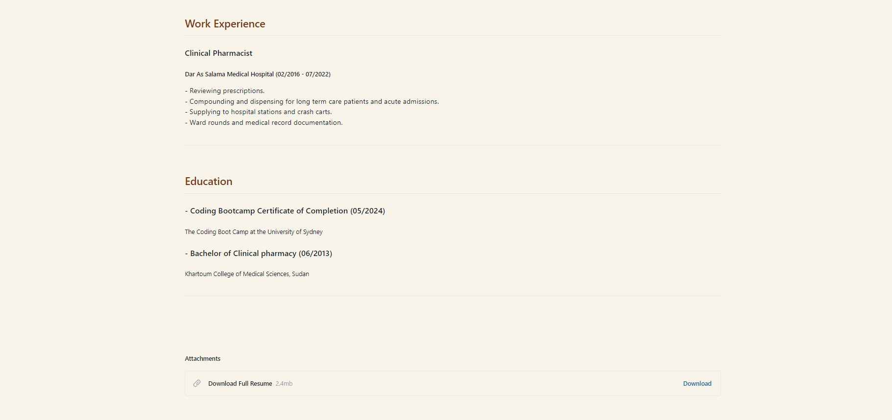

# React Portfolio

## User Story:

AS AN employer looking for candidates with experience building single-page applications
I WANT to view a potential employee's deployed React portfolio of work samples
SO THAT I can assess whether they're a good candidate for an open position

## Description:

This is my portfolio that shows information about myself, examples of my applications, contact info, and resume. It was created using React and it utilizes tailwind css.

## Installation

- Download it through Github
- Run npm i in terminal to install packages

## Application Preview

 

The web application is hosted on Netlify. Link to deployed website: [React Portfolio](https://main--yousra-portfolio.netlify.app/)
 

Homepage / About Me

Portfolio

Contact Me

Resume

## Credits

- USYD-Bootcamp (week 20 class activities)
 
